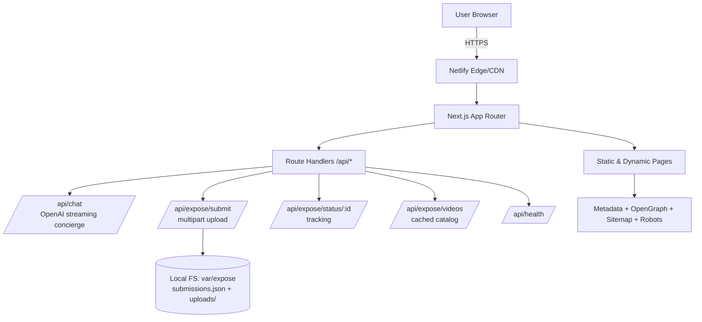

# VANHSYA Website — Complete System Reference Guide (2026-04-04)

This document is the canonical reference for the VANHSYA website system. It covers architecture, implementation details, configuration, APIs, data models, deployment, testing, security, performance, maintenance, troubleshooting, and best practices.

Related docs:
- Full audit report: [TECHNICAL_AUDIT_2026-04-04.md](file:///Users/vyshnav/VANHSYA_CLEAN_BACKUP_20250719_175427/docs/TECHNICAL_AUDIT_2026-04-04.md)
- Navigation map: [NAVIGATION_STRUCTURE.md](file:///Users/vyshnav/VANHSYA_CLEAN_BACKUP_20250719_175427/docs/NAVIGATION_STRUCTURE.md)

---

## 1) System Overview

### What this system is
- A Next.js App Router website for VANHSYA Global Migration.
- A marketing + product platform (services, countries, AI tools) with an **Expose** module that supports migration fraud victims (submissions, tracking, case library, scammer profiles, industry watch, video storytelling).

### Primary goals
- High-end, conversion-oriented UX with responsive design.
- Safe handling of user-submitted victim reports and evidence.
- Strong SEO foundations (metadata, sitemap, robots).
- Production-ready CI/deploy pipeline.

---

## 2) Technical Architecture

### High-level architecture diagram



### Runtime and rendering model
- Next.js App Router defaults to Server Components; client components are used where interactivity is required.
- Rendering split:
  - **Static**: Most marketing pages are prerendered.
  - **Dynamic**: Parameterized pages and some APIs render on demand.

Key implementation files:
- App root layout: [layout.tsx](file:///Users/vyshnav/VANHSYA_CLEAN_BACKUP_20250719_175427/src/app/layout.tsx)
- Global CSS: [globals.css](file:///Users/vyshnav/VANHSYA_CLEAN_BACKUP_20250719_175427/src/app/globals.css)
- Next config: [next.config.js](file:///Users/vyshnav/VANHSYA_CLEAN_BACKUP_20250719_175427/next.config.js)

---

## 3) Development Stack

### Languages and frameworks
- TypeScript (strict): [tsconfig.json](file:///Users/vyshnav/VANHSYA_CLEAN_BACKUP_20250719_175427/tsconfig.json)
- React 19
- Next.js 16 (webpack mode)
- Tailwind CSS

### Key libraries
- UI/animation: `framer-motion`, `lucide-react`, `react-icons`
- 3D/visualization: `three`, `@react-three/fiber`, `@react-three/drei`
- AI: `ai` (Vercel AI SDK), `@ai-sdk/openai`

### Fonts
- Inter (body) and Space Grotesk (headings) via `next/font/google`.
- Tailwind font mappings: [tailwind.config.ts](file:///Users/vyshnav/VANHSYA_CLEAN_BACKUP_20250719_175427/tailwind.config.ts#L13-L18)

---

## 4) Repository Structure

Top-level:
- `src/app/` — routes (pages and API route handlers)
- `src/components/` — reusable UI components
- `src/data/` — structured static data (including Expose)
- `src/lib/` — shared utilities and domain modules
- `public/` — static assets
- `docs/` — documentation

---

## 5) Setup Instructions (Local Development)

### Prerequisites
- Node.js 20+
- npm 9+

### Install & run

```bash
npm ci
npm run dev
```

### Common dev commands
- Lint:

```bash
npm run lint
```

- Build:

```bash
npm run build
```

Scripts are defined in: [package.json](file:///Users/vyshnav/VANHSYA_CLEAN_BACKUP_20250719_175427/package.json#L5-L15)

### Environment variables
- `.env.local` is used in development.
- Required for AI concierge:
  - `OPENAI_API_KEY` (required for `/api/chat`)
  - `OPENAI_MODEL` (optional, defaults to `gpt-4o`)

---

## 6) Routing & Navigation

### Routing model
- Pages: `src/app/**/page.tsx`
- API endpoints: `src/app/api/**/route.ts`
- SEO routes: `src/app/robots.ts`, `src/app/sitemap.ts`

### Navigation source-of-truth
- See: [NAVIGATION_STRUCTURE.md](file:///Users/vyshnav/VANHSYA_CLEAN_BACKUP_20250719_175427/docs/NAVIGATION_STRUCTURE.md)

### Primary navigation component
- Premium header: [NavigationPremium.tsx](file:///Users/vyshnav/VANHSYA_CLEAN_BACKUP_20250719_175427/src/components/NavigationPremium.tsx)
  - Includes trust ticker
  - Dropdown menus
  - Floating “island” glassmorphism header styles (via `globals.css`)

---

## 7) Expose Platform (Migration Fraud Victim System)

### Pages
- Landing: `/expose` → [ExposeLanding.tsx](file:///Users/vyshnav/VANHSYA_CLEAN_BACKUP_20250719_175427/src/components/expose/ExposeLanding.tsx)
- Victim submissions: `/expose/victim-stories` → [VictimStories.tsx](file:///Users/vyshnav/VANHSYA_CLEAN_BACKUP_20250719_175427/src/components/expose/VictimStories.tsx)
- Interviews: `/expose/interviews` → [ExposeInterviews.tsx](file:///Users/vyshnav/VANHSYA_CLEAN_BACKUP_20250719_175427/src/components/expose/ExposeInterviews.tsx)
- Industry watch: `/expose/industry-watch` → [IndustryWatch.tsx](file:///Users/vyshnav/VANHSYA_CLEAN_BACKUP_20250719_175427/src/components/expose/IndustryWatch.tsx)
- Scammer profiles: `/expose/scammers` → [ScammersList.tsx](file:///Users/vyshnav/VANHSYA_CLEAN_BACKUP_20250719_175427/src/components/expose/ScammersList.tsx)
- Scammer profile detail: `/expose/scammers/[slug]` → [ScammerProfile.tsx](file:///Users/vyshnav/VANHSYA_CLEAN_BACKUP_20250719_175427/src/components/expose/ScammerProfile.tsx)
- Published case detail: `/expose/cases/[slug]` → [ExposeCase.tsx](file:///Users/vyshnav/VANHSYA_CLEAN_BACKUP_20250719_175427/src/components/expose/ExposeCase.tsx)
- Submission tracking: `/expose/track/[id]` → [TrackCase.tsx](file:///Users/vyshnav/VANHSYA_CLEAN_BACKUP_20250719_175427/src/components/expose/TrackCase.tsx)

### Data sources (content management)
- Published cases: [cases.ts](file:///Users/vyshnav/VANHSYA_CLEAN_BACKUP_20250719_175427/src/data/expose/cases.ts)
- Interviews: [interviews.ts](file:///Users/vyshnav/VANHSYA_CLEAN_BACKUP_20250719_175427/src/data/expose/interviews.ts)
- Industry watch entries: [industryWatch.ts](file:///Users/vyshnav/VANHSYA_CLEAN_BACKUP_20250719_175427/src/data/expose/industryWatch.ts)
- Scammer profiles: [scammers.ts](file:///Users/vyshnav/VANHSYA_CLEAN_BACKUP_20250719_175427/src/data/expose/scammers.ts)

### Video UX
- Thumbnail-first (fast) with click-to-play modal (loads YouTube iframe only when needed).
- Video modal: [VideoModal.tsx](file:///Users/vyshnav/VANHSYA_CLEAN_BACKUP_20250719_175427/src/components/expose/VideoModal.tsx)
- Video catalog API: [videos API](file:///Users/vyshnav/VANHSYA_CLEAN_BACKUP_20250719_175427/src/app/api/expose/videos/route.ts)

### Victim submission flow
1. User fills submission form + optional evidence uploads.
2. Frontend submits multipart form to `POST /api/expose/submit`.
3. Server:
   - validates required fields
   - enforces file limits (up to 5 files, 10MB each)
   - sanitizes filename
   - writes evidence files to `var/expose/uploads/`
   - prepends submission record to JSON store
4. Server returns tracking ID.
5. User checks status via `/expose/track/:id` → `GET /api/expose/status/:id`.

---

## 8) API Documentation

All route handlers are under `src/app/api`.

### 8.1 Health

**GET** `/api/health`  
Implementation: [health route](file:///Users/vyshnav/VANHSYA_CLEAN_BACKUP_20250719_175427/src/app/api/health/route.ts)

Response shape (example):

```json
{
  "status": "ok",
  "time": "2026-04-04T00:00:00.000Z",
  "checks": {
    "videoPointer": true,
    "openaiKeyConfigured": false
  }
}
```

### 8.2 AI Concierge

**POST** `/api/chat`  
Implementation: [chat route](file:///Users/vyshnav/VANHSYA_CLEAN_BACKUP_20250719_175427/src/app/api/chat/route.ts)

Requirements:
- `OPENAI_API_KEY` must be set, otherwise returns `503`.

### 8.3 Expose — Submit a Case

**POST** `/api/expose/submit` (multipart form-data)  
Implementation: [submit route](file:///Users/vyshnav/VANHSYA_CLEAN_BACKUP_20250719_175427/src/app/api/expose/submit/route.ts)

Form fields:
- `scamType` (required)
- `severity` (required)
- `country` (required)
- `summary` (required)
- `amountLost` (optional)
- `contactPreference` (optional, default `Email`)
- `anonymous` (optional, default `true`)
- `contactEmail` (optional)
- `contactPhone` (optional)
- `evidence` (optional, repeated up to 5 files)

Example:

```bash
curl -s -X POST http://localhost:3000/api/expose/submit \
  -F scamType='Fake Agent / Consultancy' \
  -F severity='High' \
  -F country='UAE' \
  -F summary='Example case' \
  -F anonymous='true'
```

Response:

```json
{ "id": "vx_<uuid>", "status": "received" }
```

### 8.4 Expose — Track a Case

**GET** `/api/expose/status/:id`  
Implementation: [status route](file:///Users/vyshnav/VANHSYA_CLEAN_BACKUP_20250719_175427/src/app/api/expose/status/%5Bid%5D/route.ts)

Response:

```json
{ "id": "vx_<uuid>", "createdAt": "...", "status": "received" }
```

### 8.5 Expose — Video Catalog (Cached)

**GET** `/api/expose/videos?type=interviews|cases`  
Implementation: [videos route](file:///Users/vyshnav/VANHSYA_CLEAN_BACKUP_20250719_175427/src/app/api/expose/videos/route.ts)

Response keys:
- `channel`: `{ url, subscribeUrl }`
- `interviews`: list of interview entries + `thumbnail`
- `caseVideos`: list of case videos + `thumbnail`

---

## 9) Data Models / Schemas

### 9.1 Expose submission storage (current)

Current persistence is JSON on local filesystem:
- Directory: `var/expose/`
- File: `var/expose/submissions.json`
- Uploads: `var/expose/uploads/*`
Implementation: [exposeStorage.ts](file:///Users/vyshnav/VANHSYA_CLEAN_BACKUP_20250719_175427/src/lib/exposeStorage.ts)

Schema (TypeScript):

```ts
type ExposeSubmission = {
  id: string;
  createdAt: string;
  status: 'received' | 'reviewing' | 'published' | 'rejected';
  scamType: string;
  severity: string;
  country: string;
  amountLost?: string;
  summary: string;
  contactPreference: 'WhatsApp' | 'Email' | 'Call';
  anonymous: boolean;
  contactEmail?: string;
  contactPhone?: string;
  evidenceFiles: { name: string; path: string; size: number; type: string }[];
};
```

### 9.2 Expose content schemas (published data)
- `ExposeCase` (covers, optional `youtubeId`): [cases.ts](file:///Users/vyshnav/VANHSYA_CLEAN_BACKUP_20250719_175427/src/data/expose/cases.ts)
- `ExposeInterview`: [interviews.ts](file:///Users/vyshnav/VANHSYA_CLEAN_BACKUP_20250719_175427/src/data/expose/interviews.ts)
- `IndustryWatchItem`: [industryWatch.ts](file:///Users/vyshnav/VANHSYA_CLEAN_BACKUP_20250719_175427/src/data/expose/industryWatch.ts)
- `ScammerProfile`: [scammers.ts](file:///Users/vyshnav/VANHSYA_CLEAN_BACKUP_20250719_175427/src/data/expose/scammers.ts)

### 9.3 Database schema (production recommendation)

No DB is used currently. For production durability (especially on Netlify/Vercel), use:
- Postgres table: `expose_submissions`
- Object storage bucket: `expose_evidence`

Suggested Postgres schema (high-level):

```sql
create table expose_submissions (
  id text primary key,
  created_at timestamptz not null default now(),
  status text not null check (status in ('received','reviewing','published','rejected')),
  scam_type text not null,
  severity text not null,
  country text not null,
  amount_lost text,
  summary text not null,
  contact_preference text not null,
  anonymous boolean not null default true,
  contact_email text,
  contact_phone text
);

create table expose_evidence (
  id bigserial primary key,
  submission_id text not null references expose_submissions(id) on delete cascade,
  object_key text not null,
  filename text not null,
  content_type text not null,
  size_bytes bigint not null
);
```

---

## 10) Configuration Files Reference

### Next.js
- [next.config.js](file:///Users/vyshnav/VANHSYA_CLEAN_BACKUP_20250719_175427/next.config.js)
  - Image host allowlist includes YouTube thumbnails (`i.ytimg.com`).
  - `optimizePackageImports` enabled.

### Tailwind
- [tailwind.config.ts](file:///Users/vyshnav/VANHSYA_CLEAN_BACKUP_20250719_175427/tailwind.config.ts)

### ESLint
- [eslint.config.mjs](file:///Users/vyshnav/VANHSYA_CLEAN_BACKUP_20250719_175427/eslint.config.mjs)

### Deployment (Netlify)
- [netlify.toml](file:///Users/vyshnav/VANHSYA_CLEAN_BACKUP_20250719_175427/netlify.toml)
  - Security headers
  - Cache-control
  - Redirects

### CI
- [ci.yml](file:///Users/vyshnav/VANHSYA_CLEAN_BACKUP_20250719_175427/.github/workflows/ci.yml)
- [deploy-netlify.yml](file:///Users/vyshnav/VANHSYA_CLEAN_BACKUP_20250719_175427/.github/workflows/deploy-netlify.yml)

---

## 11) Deployment Procedures (Production)

### Netlify deployment (recommended current configuration)
1. Ensure Netlify site is connected to the repo.
2. Configure environment variables in Netlify:
   - `OPENAI_API_KEY` (if concierge must be enabled)
   - any analytics tokens you use
3. Deploy from `main` branch:
   - GitHub Actions workflow runs build and deploys using secrets:
     - `NETLIFY_AUTH_TOKEN`
     - `NETLIFY_SITE_ID`
4. Validate:
   - `/api/health` returns 200
   - key routes load
   - check Functions logs for `/api/*`

Important: Expose file uploads are not durable on serverless without persistent storage. If Expose submissions are critical in production, implement DB + object storage first.

---

## 12) Testing Protocols

### Automated checks (current)
- Lint: `npm run lint`
- Typecheck (CI): `npx tsc --noEmit`
- Build: `npm run build`
- Spellcheck (CI): `npm run spell`

### Manual QA checklist
- Navigation:
  - Desktop dropdown behavior
  - Mobile menu open/close and scroll lock
- SEO:
  - `sitemap.xml` accessible and correct
  - `robots.txt` points to sitemap
- Expose:
  - Submit a victim story (with and without evidence files)
  - Confirm tracking link works
  - Confirm video modal opens and closes (ESC, overlay click)
- AI:
  - `/api/chat` returns `503` when missing key; streams when configured

---

## 13) Security Measures & Best Practices

### Current measures
- Strong baseline security headers in Netlify config: [netlify.toml](file:///Users/vyshnav/VANHSYA_CLEAN_BACKUP_20250719_175427/netlify.toml)
- Upload constraints in Expose submit route:
  - max 5 files
  - max 10MB each
  - filename sanitization
  - no secrets returned in health checks

### Known risks
- Local filesystem storage for uploads/submissions is not durable on serverless.
- Evidence metadata stores server paths; safer to store opaque IDs or object keys only.
- `npm audit` reports moderate vulnerabilities in AI SDK dependency graph.

Recommended security hardening:
- Add CSP headers (Netlify) with a strict policy allowing required YouTube embeds.
- Store evidence in object storage and scan uploads (optional) before publishing.
- Use rate limiting for `/api/expose/submit` and `/api/chat`.

---

## 14) Performance Benchmarks & Optimization Guidelines

### Current optimization levers
- Next image optimization with WebP/AVIF: [next.config.js](file:///Users/vyshnav/VANHSYA_CLEAN_BACKUP_20250719_175427/next.config.js)
- Import optimization for heavy libs: [next.config.js](file:///Users/vyshnav/VANHSYA_CLEAN_BACKUP_20250719_175427/next.config.js#L41-L44)
- Video: thumbnail-first, iframe deferred via modal.

### Recommended benchmark process
- Use Lighthouse (local + CI) on:
  - `/`
  - `/expose/victim-stories`
  - `/expose/interviews`
- Track:
  - LCP, CLS, INP
  - Total blocking time
  - JS bundle size

### Highest-impact optimizations
- Dynamically import 3D components only where needed.
- Keep pages server components by default; isolate interactivity into small client components.
- Avoid large icon packs imported broadly.

---

## 15) Maintenance Procedures

### Dependency maintenance
- Monthly:
  - `npm outdated`
  - `npm audit`
- Quarterly:
  - Test major upgrades (Next, React, AI SDK) in a branch.

### Content maintenance
- Add/update published cases: edit [cases.ts](file:///Users/vyshnav/VANHSYA_CLEAN_BACKUP_20250719_175427/src/data/expose/cases.ts)
- Add/update interviews: edit [interviews.ts](file:///Users/vyshnav/VANHSYA_CLEAN_BACKUP_20250719_175427/src/data/expose/interviews.ts)
- Add/update industry watch: edit [industryWatch.ts](file:///Users/vyshnav/VANHSYA_CLEAN_BACKUP_20250719_175427/src/data/expose/industryWatch.ts)
- Add/update scammer profiles: edit [scammers.ts](file:///Users/vyshnav/VANHSYA_CLEAN_BACKUP_20250719_175427/src/data/expose/scammers.ts)

### Operational maintenance
- Keep at least 3–5GB free disk space in dev environments (Next dev writes many transient files).
- Clear `.next` if you see `ENOSPC` or corrupted dev state.

---

## 16) Troubleshooting Guide

### Server won’t start: `EADDRINUSE`
- Cause: port already in use.
- Fix:
  - Find and stop process using the port (macOS):
    - `lsof -nP -iTCP:3000 -sTCP:LISTEN`
    - `kill <PID>`

### Build/dev fails: `ENOSPC` (no space left on device)
- Cause: insufficient disk space; Next cannot write build manifests.
- Fix:
  - Delete `.next/`
  - Clear npm cache (`npm cache clean --force`)
  - Free disk space (Caches, downloads, large assets)

### `/api/chat` returns 503
- Cause: `OPENAI_API_KEY` missing.
- Fix: set `OPENAI_API_KEY` in `.env.local` or in Netlify environment variables.

### Expose uploads “work locally but not in production”
- Cause: serverless filesystem is not durable.
- Fix: move to persistent storage (object storage + DB).

---

## 17) Integration Guidelines

### Adding a new Expose interview (YouTube)
1. Add entry to [interviews.ts](file:///Users/vyshnav/VANHSYA_CLEAN_BACKUP_20250719_175427/src/data/expose/interviews.ts)
2. The video catalog API automatically serves thumbnails via `i.ytimg.com`.
3. The UI will show thumbnails and play in modal.

### Adding a new published case
1. Add to [cases.ts](file:///Users/vyshnav/VANHSYA_CLEAN_BACKUP_20250719_175427/src/data/expose/cases.ts)
2. Include:
  - `coverImage` (recommended)
  - `youtubeId` (optional)
  - `redFlags`, `whatWorked`, `summary`, `fullStory`

---

## 18) Best Practices (Operational + Engineering)

- Prefer Server Components for pages; isolate client-only logic.
- Use `next/image` for all non-trivial imagery.
- Defer heavy work (video iframes, 3D scenes) until user intent.
- Treat Expose submissions as sensitive:
  - avoid storing raw paths or secrets
  - implement durable storage and minimal retention policies
- Keep CI green:
  - `npm run lint`
  - `npm run build`

